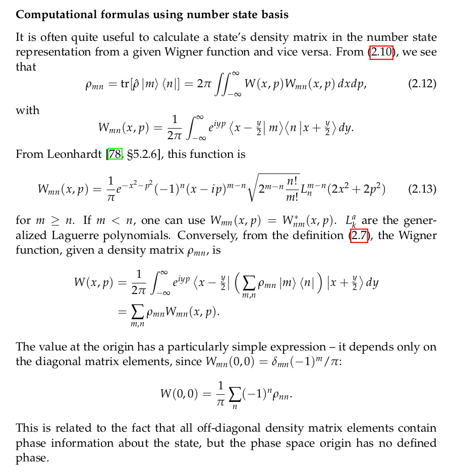

# SCIQIS activities 05

## QuTiP

1. Browse through the many tutorials on [QuTiP's website](https://qutip.org/qutip-tutorials/). If some of them are aligned with your quantum science interests, then feel free to dig into them and code along.

### Solving master equations with QuTiP

2. Starting from [this QuTiP tutorial](https://nbviewer.org/urls/qutip.org/qutip-tutorials/tutorials-v5/time-evolution/006_photon_birth_death.ipynb) which replicates [one of the papers on cavity QED](http://dx.doi.org/10.1038/nature05589) that contributed to the 2012 Nobel prize of Serge Haroche, try to come up with new ways to visualise the results. This could be as a static plot, an animation, or an interactive plot. 
3. Change the parameters of the simulation, like changing the initial state, the time steps, the number of trajectories, the coupling rate, environment temperate, etc. - you may discover something interesting by varying these.

Note that you can store all trajectories with the `keep_runs_results` option to `mcsolve` described [here](https://qutip.readthedocs.io/en/stable/guide/dynamics/dynamics-monte.html) (under Monte Carlo Solver Result), and then access e.g. the expectation of the operators in `e_ops` at each time with the result's `runs_expect` property.

## Calculating density matrices

An arbitrary quantum state of a single bosonic mode can be represented mathematically in many different ways. Two of the most common are the Wigner function (a quasi-probability distribution over phase space) or the density matrix in Fock basis: $\rho_{mn} = \langle m|\hat{\rho}|n \rangle$. The two are equivalent, and your task here is to write code for converting between the two representations.

Here's a snippet with the most straight-forward conversion formulas from [my thesis](https://figshare.com/articles/thesis/Generation_of_single_photons_and_Schr_dinger_kitten_states_of_light/1328405?file=1939711):

The generalised Laguerre polynomia (and the Hermite polynomia used below) are available in SciPy.

For Gaussian states, there are explicit formulas for the individual density matrix elements given as eqs. (4.9) and (4.10) in [this 1994 paper by G. Adam](http://www.tandfonline.com/doi/abs/10.1080/09500349514551141) (but you have to dig into the paper to find out what all the symbols mean).

4. Write some code to convert from a Wigner function to a density matrix and back again.
5. Test it with your Gaussian states from yesterday.
6. Compare with what you get from using QuTiP. Do they match?
7. Compare runtimes using `%timeit` - and if your code is slow, inspect it with `%prun` and `%lprun` to identify potential bottlenecks.