# SCIQIS

Scientific computing in quantum information science

_DTU, August 2025_

---

## TOC

* What is scientific computing?
* Me and you
* Course overview
* Tools

---
## Scientific computing

**doing computing for science**

or

**doing science with computers**

?

--

3 primary methods in physics:

1. Theoretical modeling
2. Experiments
3. Numerical simulation

(+ observation: not in quantum) 

note: All three (may) use computers:
1. Mathematica
2. Data analysis, experiment control
3. Well...

--

Experience from QPIT labs

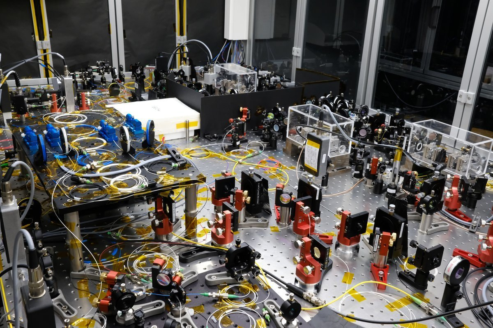

--

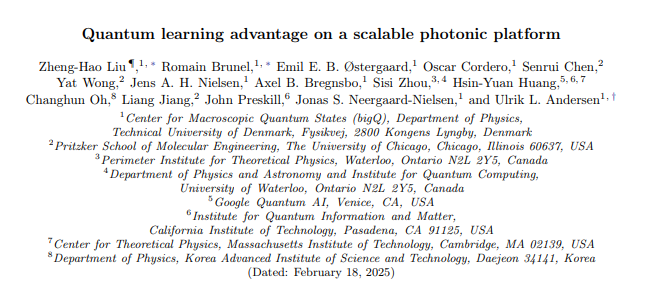

* [arxiv.org/abs/2502.07770](https://arxiv.org/abs/2502.07770)
* [github.com/qpit/ee-dl](https://github.com/qpit/ee-dl/tree/plots)
* [DTU Data](https://data.dtu.dk/articles/dataset/Data_and_code_for_Quantum_learning_advantage_on_a_scalable_photonic_platform_/29517107)

--
<split even>
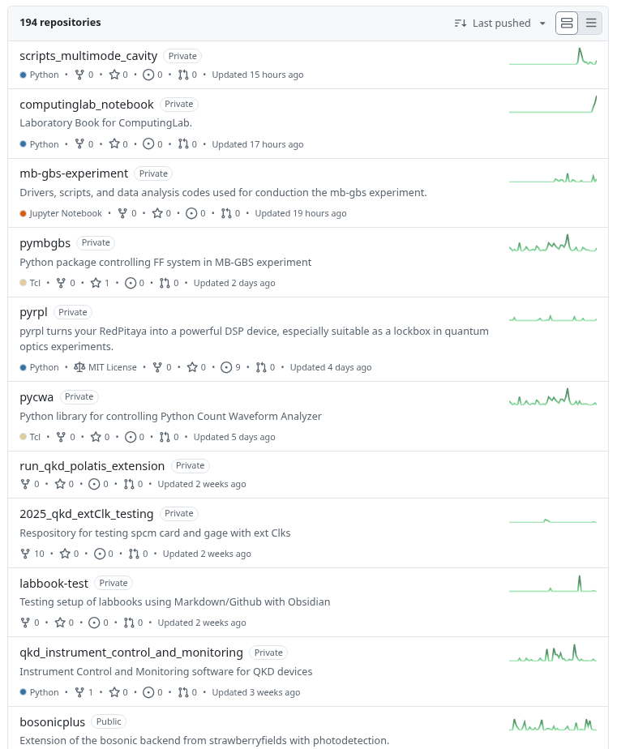

::: block

[github.com/qpit](https://github.com/orgs/qpit/repositories)

:::
</split>

---

## Me and you

--

### Me

* Trained as quantum optics experimentalist at NBI 🪞🔧🔦
* At DTU since 2011 after 3 years at NICT, Tokyo 🇩🇰>🇯🇵>🇩🇰
* Currently supervising ~20 PhDs and postdocs 🎓 (all using code)
* Happy when coding 😃 - but not much time these days 😢

--

### My coding experience

<split left="2" right="1">
::: block
- teenager: Visual Basic
- high school: TI-92 calculator
- 1st year @ KU: Fortran
- bachelor: Matlab
- MSc, PhD: Mathematica
:::
::: block
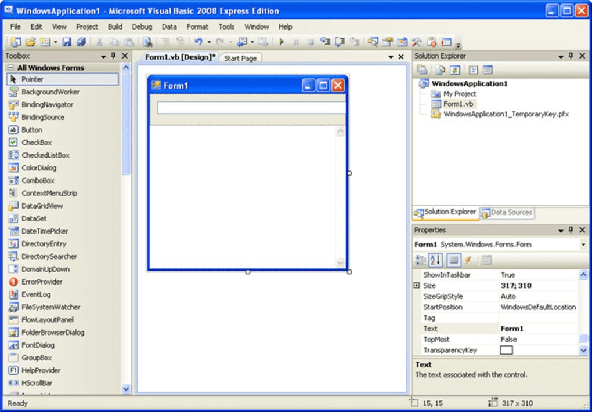
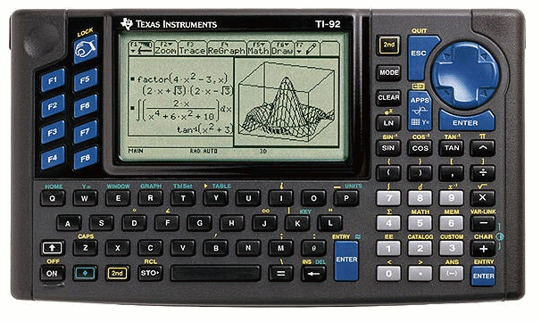
:::
</split> 

--

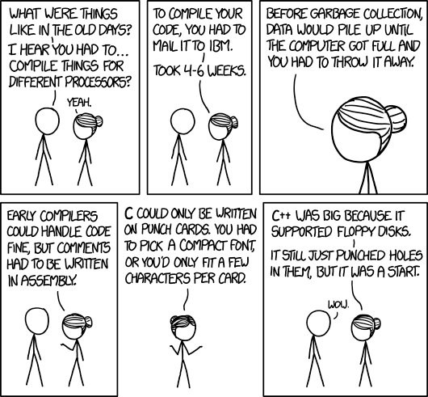

--

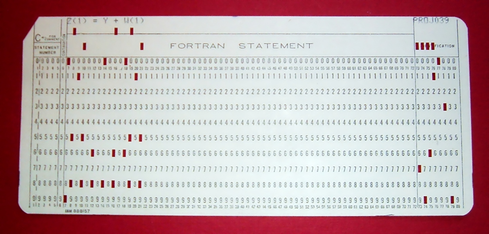

--

### My coding experience

Since 2009: Python

But... I'm a physicist, not a programmer \
– so I have 15+ years experience of writing (bad) Python code 💩

--
### What you can expect from me:

* Insights (but little expertise) in many aspects of Python and application to quantum optics and quantum information
* Half-finished 😓 lectures and tutorials
* Availability for in-person and all-class guidance
* Enthusiasm for the subject
* Desire for you to learn
* Openness to learn from you

--
### I expect from you:

- Experience with Python (different levels)
- Familiarity with
    - quantum mechanics
    - (ideally) quantum information / quantum optics
- Curiosity and eagerness
- Looking up docs, guides, tutorials, videos as needed - or GenAI
- Willingness to share with and to learn from others

--

### Use of AI

* Large language models like GPT are amazing assistants
* Use them as much as you want
* But:
	* you MUST understand what you do
	* don't just copy-paste blindly
* Don't forget the Way of the Elders:
	* look up the docs
	* search Stack Overflow

--

### You?

---

## Course overview

* short intros
* lots of work on your own
* much interaction (with me and fellow students)
* learn by doing - and sharing

--

### Focus on <u>DOING</u>

* creating your own code
* finding and studying resources (physics and computing) yourself
* explore a topic as broadly or deeply as you wish
* not much focus on special-purpose packages (QuTiP is an exception because of its general utility)

--

### Tentative schedule

| day   | date    | activity / theme                                                | physics                    |
| ----- | ------- | --------------------------------------------------------------- | -------------------------- |
| 1     | 4/8     | intro to course environments                                 |                            |
| 2     | 5/8     | Python basics (if needed) NumPy                                 | qubits, quantum channels   |
| 3     | 6/8     | more NumPy                                                      | quantum circuit simulation |
| 4     | 7/8     | visualisation profiling and speeding up                      | continuous-variable states |
| 5     | 8/8     | data analysis file I/O                                       | quantum state tomography   |
| 6     | 11/8    | QuTiP                                                           | cavity QED                 |
| 7     | 12/8    | packaging other relevant packages buffer for other topics | ...                        |
| 8—13  | 13—20/8 | Project work                                                    | your choice!               |
| 14-15 | 21-22/8 | Project presentations + feedback                                |                            |

--
### Daily activities days 1—7 (or 8)

Loose schedule:

* Pre-planned lecture mixed with live coding examples
	* supposed to be interactive - please interrupt and engage!
	* you can also add comments, questions and related info on the [#general channel at Discord](https://discord.com/channels/1397692599908700241/1397692600584241256)
* Most of the day: work on your own
	* study tutorials while coding along
	* solve open-ended exercises
* Ad-hoc full-class sessions

--

### Daily activities days 1—7 (or 8)

* While working: discuss with your neighbours
* Come and go as you like, but don't stray far away
* I will be available most of the time 9—12 and 13—16, but will have to leave for some meetings

--

### Project work 

* Starting Wednesday or Thursday of week 2, you will start working individually or in pairs on one large project.
* You MUST
	* make use of several of the computing topics covered in class
	* create a program/simulation/numerical study with direct relation or application to quantum information science
	* document your code well ­– it must be understandable by others
	* keep tight version control
* Apart from that, you are quite free to do what you like – and can incorporate methods, packages etc. that we haven't covered

--

### Deliverable + assessment

* Your code should be
	* more or less complete by end of Wednesday of week 3
	* publicly available on Github
	* be documented such that your classmates can understand and run it
* You should present your project in 15 minutes on Thursday or Friday
* You should review and give feedback on 4(?) classmates' code

**You will pass the course by completing these three items satisfactorily**

--
### Missing topics

We could also have covered 
* Pandas
* high-performance computing
* test-driven development
* optimisation
* machine learning
* Qiskit, other quantum computer SDKs
* instrument control
* ...

– but we don't!

Software engineering – even when restricted to scientific computing – is a massive field.

--

The quantum information topics are also highly selective (loosely based on what I know best).

The main things, I hope you take away, are 
- a few tools in your belt
- a can-do attitude towards attacking scientific and engineering problems with code
- a feeling of knowing how to learn more

---

## Tools

--

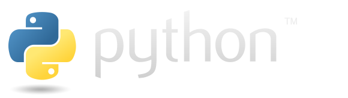

alternatives: Julia, Matlab, Mathematica, C++, R, JavaScript, ...

--

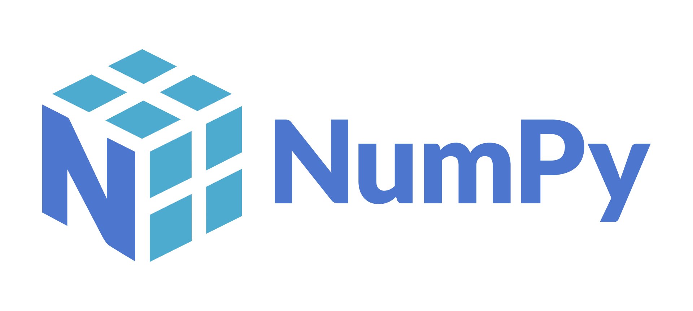

alternatives: no

--

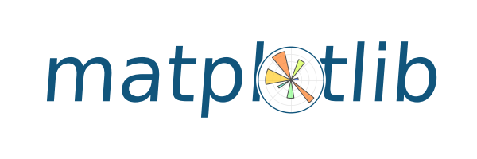

alternatives: Plotly, ggplot, Bokeh, ...

--

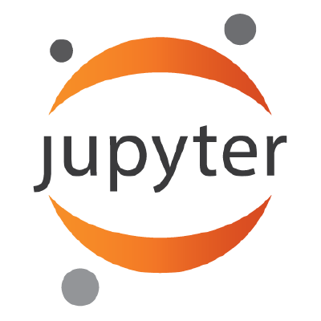

alternatives: .ipynb files can be opened in VS Code, PyCharm, Google Colab, etc.

--

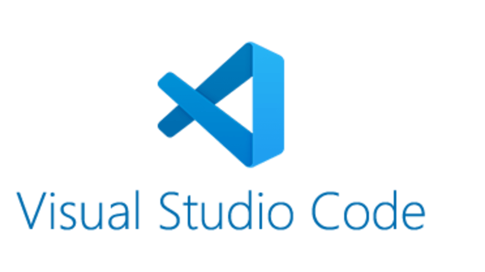
alternatives: PyCharm, Spyder, Emacs, Vim/Neovim, Sublime Text, ...

--

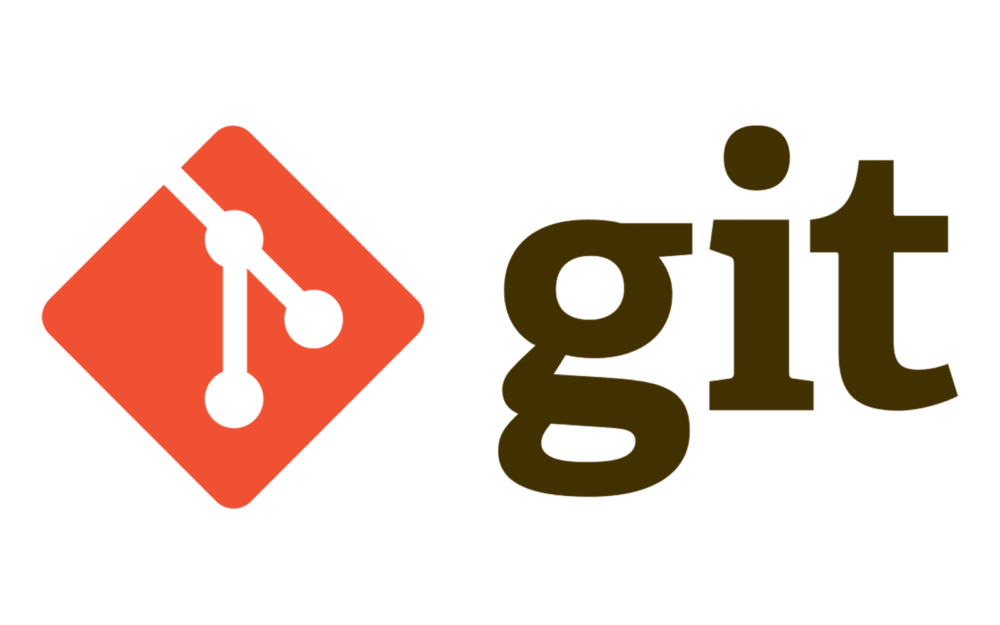

alternatives: ~SVN~, ~Mercurial~ [(94%/5%/1% in 2023)](https://stackoverflow.blog/2023/01/09/beyond-git-the-other-version-control-systems-developers-use/)

--

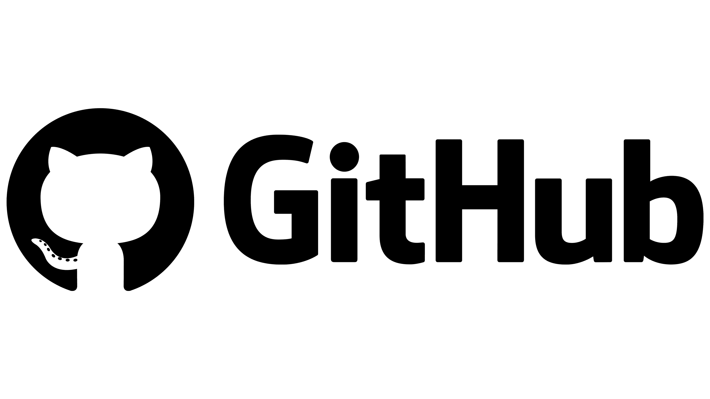
alternatives: Gitlab, Bitbucket

--

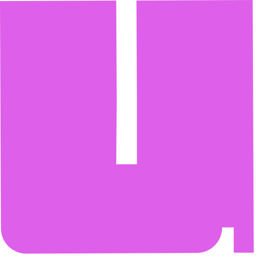
**uv**

alternatives: pip + venv, conda, Poetry, Pipenv, ...

--

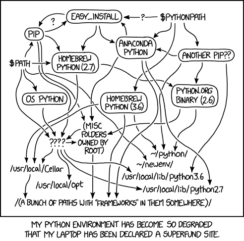

--

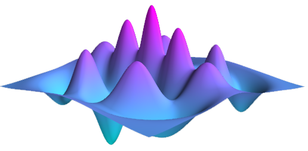

**QuTiP**

alternatives: Qiskit, Cirq, QuantumOptics.jl, Strawberry Fields, ...

--

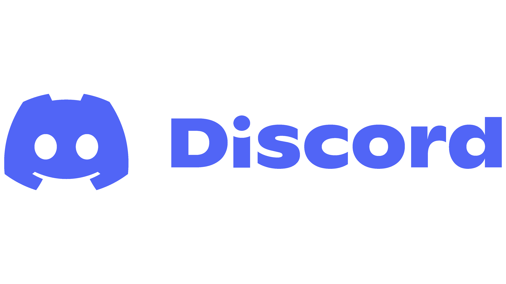

---

# Let's go!

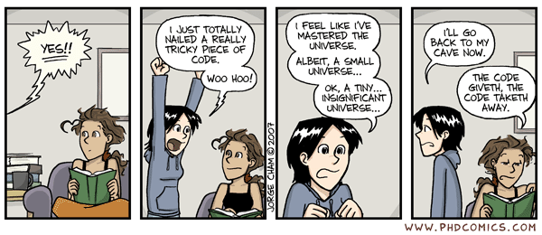

---

### Survey

https://vevox.app

Session ID: 126-954-170

