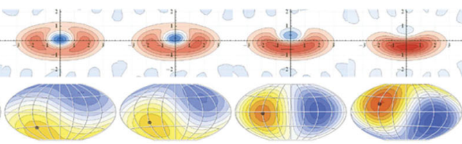
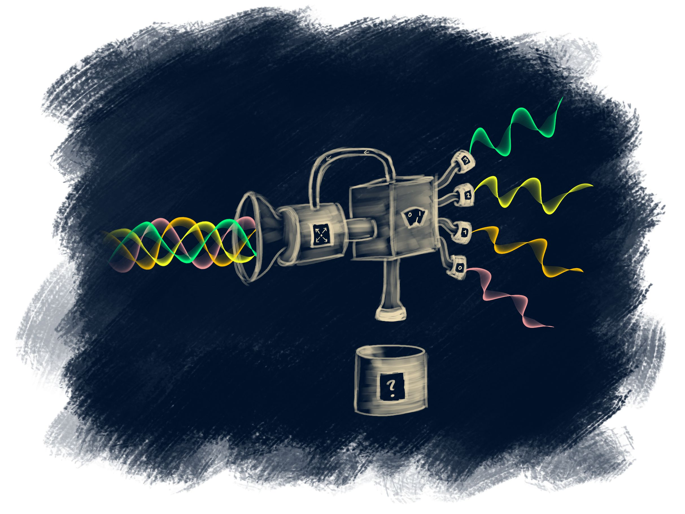
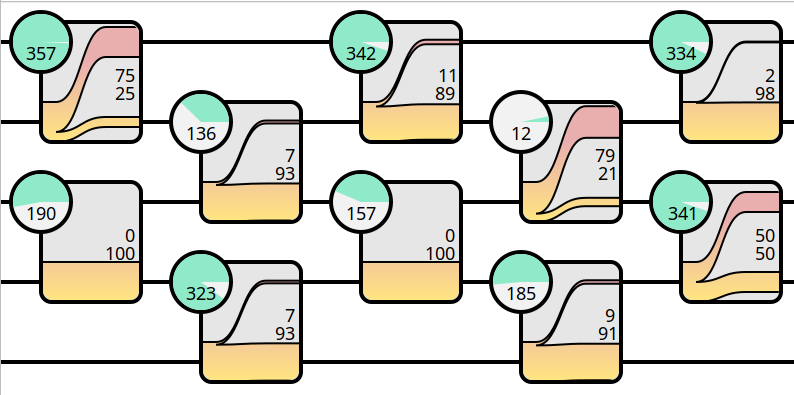
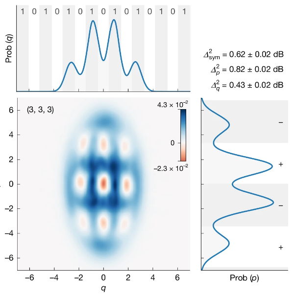
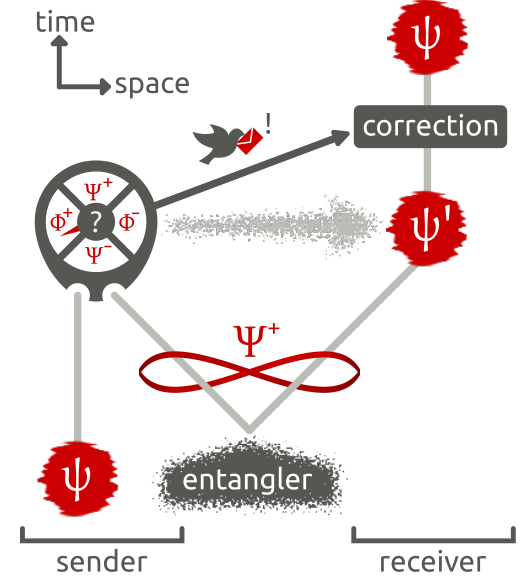
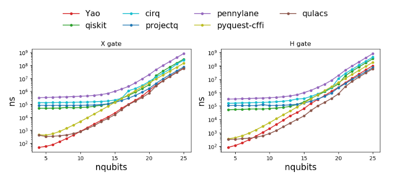
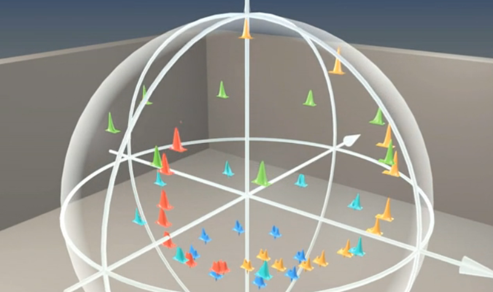
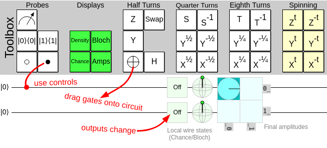

# SCIQIS: Possible projects 

For the project work, you are quite free to choose topics of physics and scientific computing that interest you. You can also put the weight on different aspects: Take a relatively simple system and explore it thoroughly with advanced code, interactive exploration, etc., or you could take an advanced physical system and explore it with more basic software tools (for example trying to reproduce results from an interesting paper).

I encourage you to come up with your own ideas, but you are also welcome to pick from the list of potential projects below, or simply get inspiration from them. Do discuss your idea with me before committing to it.

## Homodyne tomography

With homodyne detection of many identical copies of a quantum state, it is possible to reconstruct the Wigner function and density matrix.

Compare different reconstruction methods, e.g. [maximum likelihood estimation](https://journals.aps.org/rmp/abstract/10.1103/RevModPhys.81.299), [Bayesian Mean Estimate](https://iopscience.iop.org/article/10.1088/1367-2630/12/4/043034/meta), [neural networks](https://opg.optica.org/optica/fulltext.cfm?uri=optica-7-5-448&id=431506), etc.

You could also try to reproduce the results in [this paper](https://journals.aps.org/prl/abstract/10.1103/PhysRevLett.105.053602) of mine.

## Dolinar receiver

The [Dolinar receiver](https://wikipedia.org/en/Dolinar_receiver) is a feedback photon detector that can optimally distinguish between unknown quantum states from a known set. For multiple states, the optimal decision strategy is a complex optimisation problem (as described in the Concept section of [this paper](https://journals.aps.org/prl/abstract/10.1103/PhysRevLett.124.070502)). 

[This fairly recent paper](https://www.nature.com/articles/s41377-022-01039-5) uses reinforcement learning as an interesting approach to optimising the decision strategy – it could be quite interesting to study.

## Gaussian Boson Sampler generation + visualisation

Gaussian Boson Sampling is a network of beamsplitters, fed at the input with squeezed vacuum states, and sampled at the output with photon counters. It is a form of random circuit sampling.

Simulate the system and visualise the circuit and perhaps the entangled state at the output.

## Simulate GKP state generation

GKP states is a specific class of complex quantum states that can be used as "continuous-variable qubits". They have been generated in [trapped ions](https://www.nature.com/articles/s41586-019-0960-6), in [superconducting microwave cavities](https://www.nature.com/articles/s41586-020-2603-3), and – very lately – in [optics](https://doi.org/10.1038/s41586-025-09044-5).

Use QuTiP to simulate these protocols in detail - perhaps you can reproduce the results from the papers (not experimentally of course).

## Teleportation simulation

Dig deep into one of the most famous quantum information protocols: Quantum teleportation. Simulate the protocol using qubits and/or continuous variables. Include imperfections. Expand the model in different directions.

## Compare different quantum computing frameworks

There are a bunch of quantum circuit simulation frameworks. Which is faster, more user friendly, compatible with different backends, etc.?
Test many of them on specific tasks and make a detailed comparison.

Examples: [Qiskit](https://www.ibm.com/quantum/qiskit),  [Cirq](https://quantumai.google/cirq) (and [qsim](https://quantumai.google/qsim)), [ProjectQ](https://projectq.ch), [QuTiP](https://qutip.org/), [Pennylane](https://pennylane.ai), [Qulacs](https://docs.qulacs.org/en/latest/), ... (many more listed [here](https://quantiki.org/wiki/list-qc-simulators)).

Inspiration for [benchmarking](https://github.com/yardstiq/quantum-benchmarks).

## Pulse-level gates

Simulate gates on e.g. transmon qubits at the pulse-level. Explore [optimal control](https://nbviewer.org/urls/qutip.org/qutip-tutorials/tutorials-v5/optimal-control/01-optimal-control-overview.ipynb) to minimise errors.

## Wigner functions or qubits in Blender

Using Blender's comprehensive Python interface, create animations of e.g. qubits on the Bloch spheres or continuous-variable states' Wigner functions. Perform operations on the states. 

## Graphical circuit simulator

Build a Python version of [quirk](https://algassert.com/quirk).

_Note that Python is not the obvious language to use for this type of project - JavaScript would be better suited. However, using ipywidgets in a notebook could be an interesting, light-weight approach._

